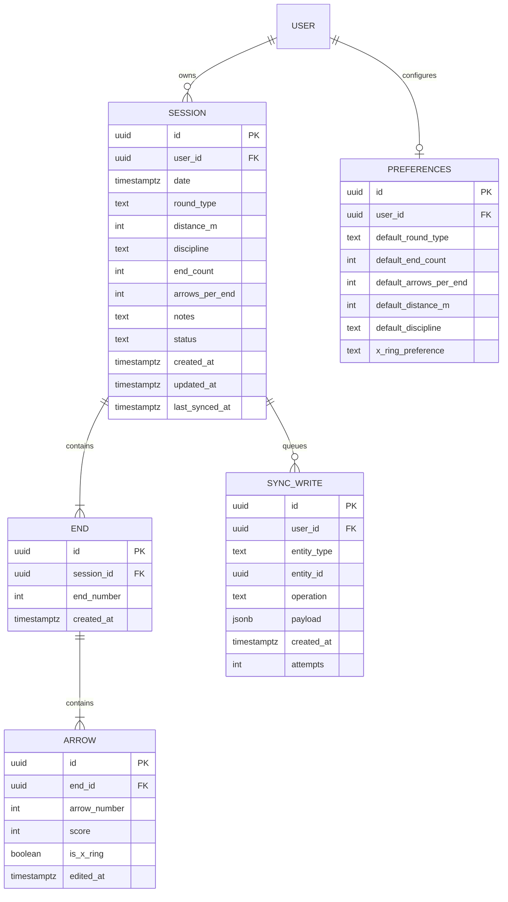

# Data Model — Archery Score Tracking

**Phase 1 output** | **Spec**: `spec.md` (FR-001..FR-018) | **Date**: 2026-09-08

## Entities & Relationships

## Enums

| Enum | Values | Notes |
|------|--------|-------|
| `Discipline` | `OLYMPIC_RECURVE`, `TRADITIONAL_RECURVE`, `BAREBOW`, `LONGBOW`, `COMPOUND` | FR-017. Stored as `text` in DB; Kotlin sealed `enum class`. |
| `RoundType` | `TEN_ZONE` (1-10, X-ring), `FIVE_ZONE` (1-5) | FR-011. Drives score validation (FR-002) and max score (FR-002 edge case). |
| `SessionStatus` | `ACTIVE`, `COMPLETE` | FR-015 resumable: `ACTIVE` sessions auto-restore. Completion is one-way via explicit user action; edits after completion require confirmation (FR-014). |
| `SyncStatus` (derived) | `SYNCED`, `PENDING`, `ERROR` | FR-010. Derived per session from `SYNC_WRITE` queue + `last_synced_at`. |

## Rules & Invariants

1. **Identity**: `Session`, `End`, `Arrow` use client-generated UUIDs (idempotent upserts for sync).
2. **Ownership**: Every row carries `user_id`; all Supabase tables enforce RLS `auth.uid() = user_id` (see contracts/storage.md).
3. **Score validation (FR-002)**: `score` MUST be within `1..max(roundType)` for `TEN_ZONE`/`FIVE_ZONE`. `is_x_ring` only allowed when `score == 10 && roundType == TEN_ZONE`. `0`/null score in a recorded arrow is rejected except in `ACTIVE` sessions where the arrow was never shot.
4. **End membership (FR-001)**: `arrows_per_end` arrows per `End`; `end_count` ends per `Session`. Session totals = sum of all arrow scores (+ X count kept separately for stats FR-008).
5. **LWW conflict resolution (FR-016)**: `Arrow.edited_at` is the conflict resolution key. When two copies of the same arrow sync, the one with the later `edited_at` wins. Sessions/ends follow the max `edited_at` of their children; session metadata uses `updated_at`.
6. **Edit confirmation (FR-014)**: Editing an arrow in a `COMPLETE` session MUST trigger an in-app confirmation; on confirm the edit bumps `edited_at` and queues a sync write. No audit trail required in v1 (out of scope per assumptions).
7. **Resume (FR-015)**: At most one `ACTIVE` session per user (spec edge case "create while another in progress"). Creating a new session while one is `ACTIVE` is blocked; user is prompted to resume or finish it. Guarded by a partial unique index on `(user_id)` where `status = 'ACTIVE'`.
8. **Offline queue (FR-005)**: Writes go to Room first (source of truth for cache), then `SYNC_WRITE` outbox; WorkManager flushes the outbox when connectivity returns (contracts/data-sync.md).
9. **Deletion (FR-009)**: Soft support via cascade — deleting a session deletes its ends/arrows and enqueues `DELETE` operations to Supabase.

## Distance & Discipline (FR-017)

- `distance_m: int` — meters, e.g. 18, 30, 70. Validated `10..300`.
- `discipline: text` — one of the enum values above.
- Both stored per `Session`; defaults populated from `PREFERENCES` at session creation.

## CSV Export (FR-018)

Derived view, no extra table. One row per arrow: `session_id, date, distance, discipline, end_number, arrow_number, score, is_x_ring`. See contracts/csv-export.md for exact format.

## Supabase ↔ Room mirroring

Supabase is the source of truth (constitution III). Room mirrors the same schema locally for offline reads/queueing. The mapping is 1:1; `SYNC_WRITE` exists only in Room (queue) until flushed.