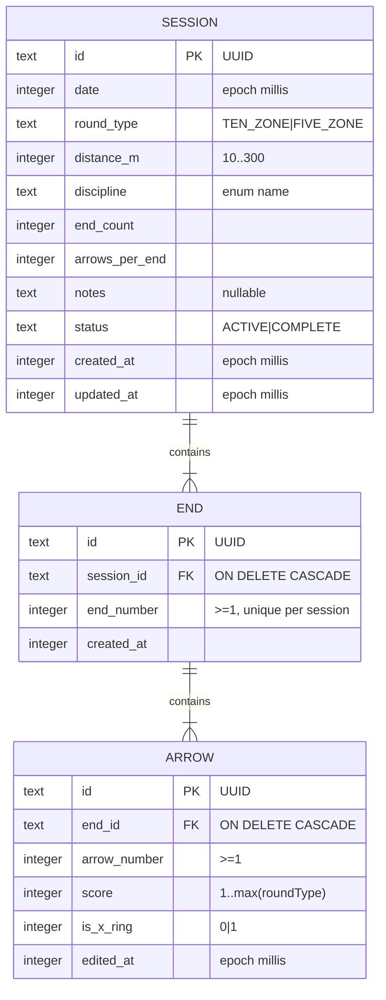

# Data Model — Local-Only Storage (Remove Supabase)

**Phase 1 output** | **Spec**: `spec.md` (FR-001..FR-015) | **Branch**: `002-local-sqlite-storage` | **Date**: 2026-09-11

## Overview

The local database (Room, `archery_score.db`) is the **sole and authoritative** store (FR-002). There is no remote mirror, no identity/namespacing, and no sync queue. Preferences live in DataStore (not Room). Decisions R-1/R-2 in `research.md` apply.

## Entities & Relationships (Room schema v2)



### Column-level changes vs version 1

| Table | Removed | Kept/Changed |
|-------|---------|--------------|
| `sessions` | `user_id`, `last_synced_at` | everything else; index on `date` only; unique **partial** index reserved for single-ACTIVE invariant (see below) |
| `ends` | — | unchanged; unique `(session_id, end_number)` |
| `arrows` | — | unchanged |
| `prefs` (Room) | whole table | **dropped** — dead code, preferences come from DataStore |
| `sync_writes` | whole table | **dropped** — sync removed |

`Session`/`SessionEntity` also drop their `userId` property; `Arrow`/`End` unchanged.

## Enums & invariants

- `Discipline`: `OLYMPIC_RECURVE`, `TRADITIONAL_RECURVE`, `BAREBOW`, `LONGBOW`, `COMPOUND` — stored as `text`, mapped in `Mapper`.
- `RoundType`: `TEN_ZONE` → `max(score) = 10` (X-ring allowed only on 10), `FIVE_ZONE` → `max(score) = 5` (`is_x_ring` always `false`).
- `SessionStatus`: `ACTIVE` (resumable, preserved across restarts — FR-011) | `COMPLETE`. Completion is one-way explicit; edits on COMPLETE require confirmation (inherited from feature 001).
- **Single-ACTIVE invariant (FR-010)**: enforced in the repository layer (`getActiveSession`/`observeActiveSession` scoped to `status = 'ACTIVE'`; creation blocked while one exists) — matching the existing behavior that feature 001 relied on. A Room partial unique index on `sessions(status)` where `status='ACTIVE'` is a documented guard if the code-level check regresses; v1 did not ship it and v2 keeps parity unless a test demands it.
- **No identity**: no `user_id` columns remain; every row implicitly belongs to the single device user (FR-006).

## Migration 1 → 2

Certified `MIGRATION_1_2` (preserves existing on-device sessions — FR-007, SC-005; no destructive fallback). minSdk 26 SQLite predates `DROP COLUMN`, so column removal uses table recreate + rename:

```sql
CREATE TABLE IF NOT EXISTS sessions_new (
  id          TEXT    NOT NULL PRIMARY KEY,
  date        INTEGER NOT NULL,
  round_type  TEXT    NOT NULL,
  distance_m  INTEGER NOT NULL,
  discipline  TEXT    NOT NULL,
  end_count   INTEGER NOT NULL,
  arrows_per_end INTEGER NOT NULL,
  notes       TEXT,
  status      TEXT    NOT NULL,
  created_at  INTEGER NOT NULL,
  updated_at  INTEGER NOT NULL
);

INSERT INTO sessions_new (id, date, round_type, distance_m, discipline,
                          end_count, arrows_per_end, notes, status, created_at, updated_at)
SELECT id, date, round_type, distance_m, discipline,
       end_count, arrows_per_end, notes, status, created_at, updated_at
FROM sessions;

DROP TABLE sessions;
ALTER TABLE sessions_new RENAME TO sessions;
CREATE INDEX IF NOT EXISTS index_sessions_date ON sessions(date);

DROP TABLE sync_writes;
DROP TABLE prefs;
```

`ends` / `arrows` are untouched; FKs remain valid (rows copied before rename). Room schema identity is revalidated via the exported schema JSON in `androidApp.room.schemaLocation` — instrumented migration test asserts v1 data survives.

## Storage semantics

| Concern | Behavior |
|---------|----------|
| Source of truth | Local Room DB (FR-002); nothing external |
| Persistence across restarts/force-close | Room ACID; in-progress ACTIVE session restored (FR-011) |
| Distributed/CRDT concerns (LWW edited_at, outbox) | **Removed** — no sync, no conflict resolution |
| Preferences | DataStore single-file prefs (default round type/end count/arrows per end/distance/discipline/X-ring preference); `local_user_id` key removed |
| DB corrupt/missing (FR-012) | Missing → fresh empty DB (empty states render). Corrupt → delete + rebuild empty, no crash (R-6) |

## CSV round-trip (derived view)

No extra tables. Export = one row per arrow (denormalized session metadata). Import = group rows by `session_id`, reconstruct `SESSION`/`END`/`ARROW`, `status = COMPLETE`. Exact format and validation rules are contracted in `contracts/csv-roundtrip.md`.