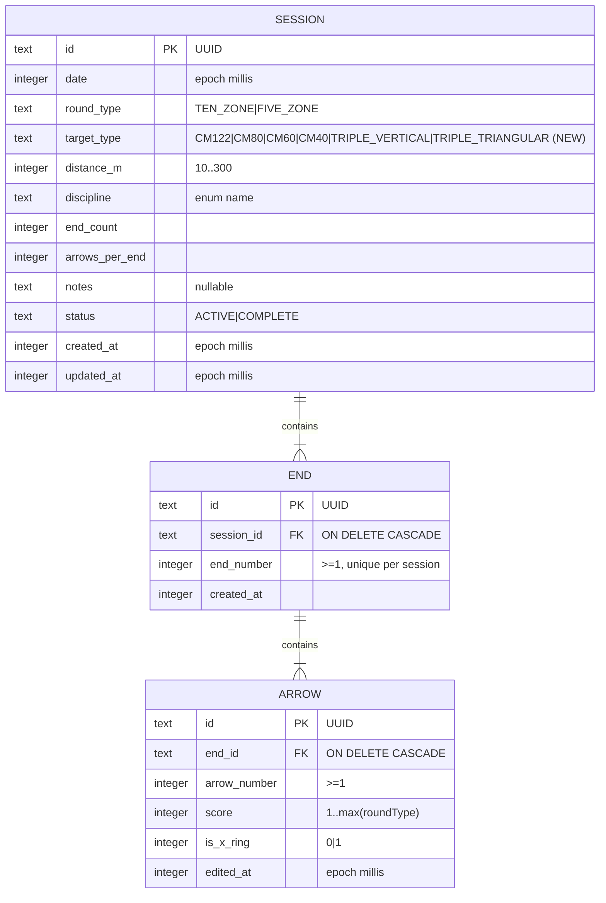

# Data Model — Visual Target Arrow Placement

**Phase 1 output** | **Spec**: `spec.md` (FR-001..FR-015) | **Branch**: `003-target-arrow-input` | **Date**: 2026-09-15

Decisions D-1..D-6 in `research.md` apply.

## Overview

No new tables. The placement is an **input method** (spec Assumption), so `Arrow`/`End` stay unchanged and confirmed arrows remain pure numeric scores. The only schema change is a new per-session `target_type` column (Room **v2 → v3**). Persistence of the target selection and the profile default are additive DataStore keys. The CSV round-trip gains one column with legacy import (R-6).

## Entities & Relationships (Room schema v3)



### Column-level change vs version 2

| Table | Added | Kept/Changed |
|-------|-------|--------------|
| `sessions` | `target_type TEXT NOT NULL DEFAULT 'CM122'` | everything else unchanged |
| `ends` | — | unchanged |
| `arrows` | — | unchanged (placement is not stored) |

`Arrow` domain model unchanged (spec: numeric score only). `Session` domain model, `SessionEntity`, and `Mapper` gain the `targetType` field.

## New domain types

### `TargetType` (enum, stored as `text` name)

`CM122`, `CM80`, `CM60`, `CM40` (single faces), `TRIPLE_VERTICAL`, `TRIPLE_TRIANGULAR` (3-spot faces). Each carries, for display/geometry only: a string-resource label, a `spotCount` (1 or 3), and spot-center layout constants (D-3). Physical face size (cm) is metadata used cosmetically; scoring is radius-normalized.

### `PlacementScorer` — pure position→score mapping (D-2)

Input: normalized point `(x, y)` in a space where **unit = one face/sub-face radius**, target type, scoring type (`TEN_ZONE`|`FIVE_ZONE`).

Output `PlacementResult`:
- `score: Int` — ring value `1..maxScore`, or `0` for a miss;
- `isXRing: Boolean` — true only when `TEN_ZONE`, `score == 10`, and `r ≤ 0.5·w`;
- `miss: Boolean` — `r ≥ 1` for the resolved face;
- `spotIndex: Int?` — resolved sub-face (null for single faces).

Rules (unit-tested, exhaustive):
- single face: center `(0,0)`; `w = 1/maxScore`; `score = maxScore − floor(r/w)` clamped `≥1`; `miss` when `r ≥ 1`; X when 10-zone and `r ≤ 0.5·w`.
- FIVE_ZONE (`maxScore = 5`): the formula yields **5 colour bands** (each of width `R/5`, values 1–5 outer→inner — one band = two 10-zone rings); `isX` is **always** `false` (consistent with `ScoreValidator`). The rendered face is the same 10-zone WA graphic for both scoring types.
- triple faces: resolve nearest spot center among the 3 centers (D-3), then apply the single-face rules relative to that spot center; `miss` when the point is beyond that spot's `r ≥ 1`.
- boundary (line touch) scores the higher inner value automatically (WA line-in-higher-zone convention) — no epsilon needed.

### Spot-center layout constants (triple faces, unit R)

WA 40cm triple spots are spaced 22cm center-to-center ⇒ `2.2R` separation (D-3). Vertical = 3 centers on a vertical line `(0,−2.2)`, `(0,0)`, `(0,+2.2)`. Triangular = `(0,−1.1)`, `(−1.1,+0.95)`, `(+1.1,+0.95)` (equilateral, height `2.2R·√3/2 ≈ 1.9R`). These constants live with `TargetType` and are independently unit-tested (`TripleLayoutTest`).

## Preferences (DataStore)

`UserPreferences` gains `defaultTargetType: TargetType = CM122`, persisted under key `default_target_type` (string of enum name; missing/invalid → fallback `CM122`, same safe-default pattern as `roundType`/`discipline`). Used by the set-up ("front") menu to pre-select the target (R-6, FR-013).

## Migration 2 → 3

Certified, additive, non-destructive (FR-014: existing numeric sessions unaffected):

```sql
ALTER TABLE sessions ADD COLUMN target_type TEXT NOT NULL DEFAULT 'CM122'
```

- minSdk 26 SQLite supports `ADD COLUMN` with a constant default — no table recreate needed.
- Room schema export JSON revalidated in instrumented tests; `MIGRATION_2_3` test asserts v2 rows (sessions/ends/arrows) survive intact with `target_type = 'CM122'`.

## CSV round-trip change (R-6, SC-006)

- Export header becomes **10 columns**: `session_id,date,distance_m,discipline,round_type,target_type,end_number,arrow_number,score,is_x_ring` (insert `target_type` after `round_type`).
- Import accepts **both** the new 10-col header and the legacy 9-col header (9-col → default `CM122`). All existing row-validation rules carry over unchanged; `target_type` adds one new rule: one of the six enum names.
- Round-trip property (`export → import → export` byte-identical incl. `target_type`) and legacy-file import are covered by new unit tests.
- Contract updated in `contracts/storage.md` (this feature) and the amended `specs/002-local-sqlite-storage/contracts/csv-roundtrip.md`.

## Storage semantics

| Concern | Behavior |
|---------|----------|
| Target selection scope | Per-session `sessions.target_type` (FR-013); shown consistently for all placement in the session |
| Default selection | DataStore `default_target_type` pre-selects the set-up menu face |
| Confirmed arrows | Stored as before (numeric `score` + `is_x_ring`); placement coordinates are **not** persisted |
| Existing sessions (pre-003) | Untouched; `target_type` backfills `CM122` on migration (FR-014) |
| Data-exchange | CSV round-trip extended to carry `target_type`; legacy files still import |
| Offline / no sync | Unchanged — Room + DataStore only, no network |